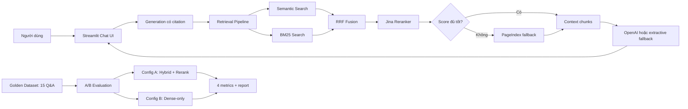

# Bài Tập Nhóm: RAG Chatbot Và Evaluation

## Tổng Quan

Sản phẩm nhóm là chatbot tra cứu pháp luật Việt Nam về ma túy và các bài báo
liên quan đến nghệ sĩ. Hệ thống kết hợp dense retrieval, BM25, RRF, Jina
reranking, PageIndex fallback và generation có citation.

Nhóm triển khai cả hai deliverable trong rubric:

1. Streamlit RAG Chatbot.
2. DeepEval Evaluation Pipeline và so sánh A/B.

## Tính Năng

- Chat bằng tiếng Việt.
- Câu trả lời có citation theo nguồn.
- Hiển thị các chunks đã dùng, loại tài liệu và retrieval score.
- Hỗ trợ follow-up dựa trên các lượt hội thoại gần nhất.
- Có câu hỏi gợi ý, xóa lịch sử, loading, empty state và error state.
- Hybrid retrieval: semantic + BM25 + RRF.
- Reranking bằng `jina-reranker-v2-base-multilingual`.
- PageIndex vectorless fallback.
- A/B evaluation trên 15 câu hỏi với 4 metrics.
- Báo cáo bottom performers và recommendations.

## Kiến Trúc



## Hệ Thiết Kế Giao Diện

Giao diện áp dụng `taste-skill` theo hướng trust-first:

- `DESIGN_VARIANCE: 4`
- `MOTION_INTENSITY: 3`
- `VISUAL_DENSITY: 5`
- Theme sáng cố định.
- Neutral lạnh và một accent xanh lục.
- Radius 14px nhất quán.
- Không dùng AI-purple, outer glow hoặc card grid ba cột.
- Bố cục desktop bất đối xứng nhẹ, mobile thu về một cột.
- Có trạng thái loading, empty và error.
- Hỗ trợ `prefers-reduced-motion`.

## Cấu Trúc

```text
group_project/
├── app.py
├── README.md
└── evaluation/
    ├── eval_pipeline.py
    ├── golden_dataset.json
    ├── evaluation_results.json
    └── results.md
```

Pipeline dùng lại các module cá nhân:

```text
src/task5_semantic_search.py
src/task6_lexical_search.py
src/task7_reranking.py
src/task8_pageindex_vectorless.py
src/task9_retrieval_pipeline.py
src/task10_generation.py
```

## Cài Đặt

Từ thư mục gốc của repo:

```powershell
python -m venv .venv
.\.venv\Scripts\Activate.ps1
pip install -r requirements.txt
```

Tạo `.env` từ `.env.example`:

```powershell
Copy-Item .env.example .env
```

Cấu hình:

```dotenv
OPENAI_API_KEY=sk-...
OPENAI_MODEL=gpt-4.1-mini
JINA_API_KEY=jina_...
PAGEINDEX_API_KEY=pi_...
```

Nếu chưa có key thật:

- Chatbot dùng extractive generation fallback.
- Jina dùng local relevance fallback.
- PageIndex dùng structural Markdown fallback.
- Evaluation chạy offline deterministic proxy.

## Chạy Chatbot

```powershell
.\.venv\Scripts\streamlit.exe run group_project\app.py
```

Mở `http://localhost:8501`.

## Conversation Memory

App lưu lịch sử bằng `st.session_state`. Khi có follow-up, tối đa bốn message
gần nhất được ghép vào retrieval query. Nội dung người dùng nhìn thấy không bị
thay đổi; history chỉ hỗ trợ hệ thống hiểu đại từ và ngữ cảnh tiếp nối.

## Evaluation

### Golden Dataset

`golden_dataset.json` có 15 câu:

- 10 câu pháp luật.
- 5 câu báo chí.
- Các mức độ `direct`, `multi_fact`, `comparison`.
- Mỗi câu có `expected_answer`, `expected_context`, `expected_sources`.

Các câu chỉ sử dụng evidence có thật trong corpus. Những câu về Điều 249 Bộ luật
Hình sự và danh mục chất trong PDF scan chưa được đưa vào vì dữ liệu hiện tại
chưa đủ text để đánh giá công bằng.

### Config A

Semantic search + BM25 + RRF + Jina reranking.

### Config B

Semantic search thuần, không fusion và không reranking.

### Bốn Metrics

- Faithfulness.
- Answer Relevance.
- Context Recall.
- Context Precision.

### Chạy Offline

```powershell
.\.venv\Scripts\python.exe group_project\evaluation\eval_pipeline.py --mode offline
```

### Chạy DeepEval

Cần `OPENAI_API_KEY` hợp lệ:

```powershell
.\.venv\Scripts\python.exe group_project\evaluation\eval_pipeline.py --mode deepeval
```

`--mode auto` tự dùng DeepEval khi có key thật, nếu không sẽ dùng offline proxy:

```powershell
.\.venv\Scripts\python.exe group_project\evaluation\eval_pipeline.py --mode auto
```

### Kết Quả Hiện Tại

| Config | Average |
|--------|---------|
| Hybrid + rerank | 0.918 |
| Dense-only | 0.751 |

Chi tiết nằm trong:

- `evaluation/results.md`
- `evaluation/evaluation_results.json`

Điểm offline dùng metric proxy minh bạch và tái lập được. Trước buổi demo nên
chạy lại bằng DeepEval với judge key thật để có LLM-based scores chính thức.

## Kịch Bản Demo

1. Mở chatbot và hỏi về thời hạn quản lý người sử dụng trái phép chất ma túy.
2. Mở phần nguồn để đối chiếu với Luật Phòng, chống ma túy 2021.
3. Hỏi follow-up: "Trong thời gian đó họ phải làm gì?"
4. Hỏi về bản án của Hữu Tín để demo dữ liệu báo chí.
5. Chạy evaluation và trình bày chênh lệch Config A/B.
6. Mở bottom performers để giải thích điểm yếu của generation.

## Phân Công

Thay tên và MSSV thật trước khi nộp.

| Thành viên | MSSV | Nhiệm vụ | Trạng thái |
|------------|------|----------|------------|
| Thành viên 1 | Điền MSSV | Data collection, conversion, indexing | Hoàn thành |
| Thành viên 2 | Điền MSSV | Retrieval, BM25, Jina reranking | Hoàn thành |
| Thành viên 3 | Điền MSSV | Streamlit UI, memory, citations | Hoàn thành |
| Thành viên 4 | Điền MSSV | Golden dataset, DeepEval, A/B report | Hoàn thành |

## Kiểm Tra

```powershell
.\.venv\Scripts\python.exe -m pytest tests\ -v
.\.venv\Scripts\python.exe -m pip check
```

Trạng thái gần nhất:

- `35/35` automated tests passed.
- `pip check` không phát hiện dependency bị hỏng.

## Giới Hạn

- Hai nghị định hiện là PDF scan và chưa có OCR đầy đủ.
- API keys mẫu trong `.env` cần được thay bằng key thật.
- Extractive fallback có citation nhưng diễn đạt kém tự nhiên hơn LLM.
- Kết quả không thay thế tư vấn pháp lý chuyên nghiệp.
